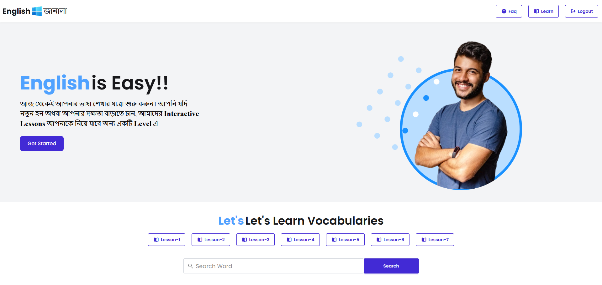
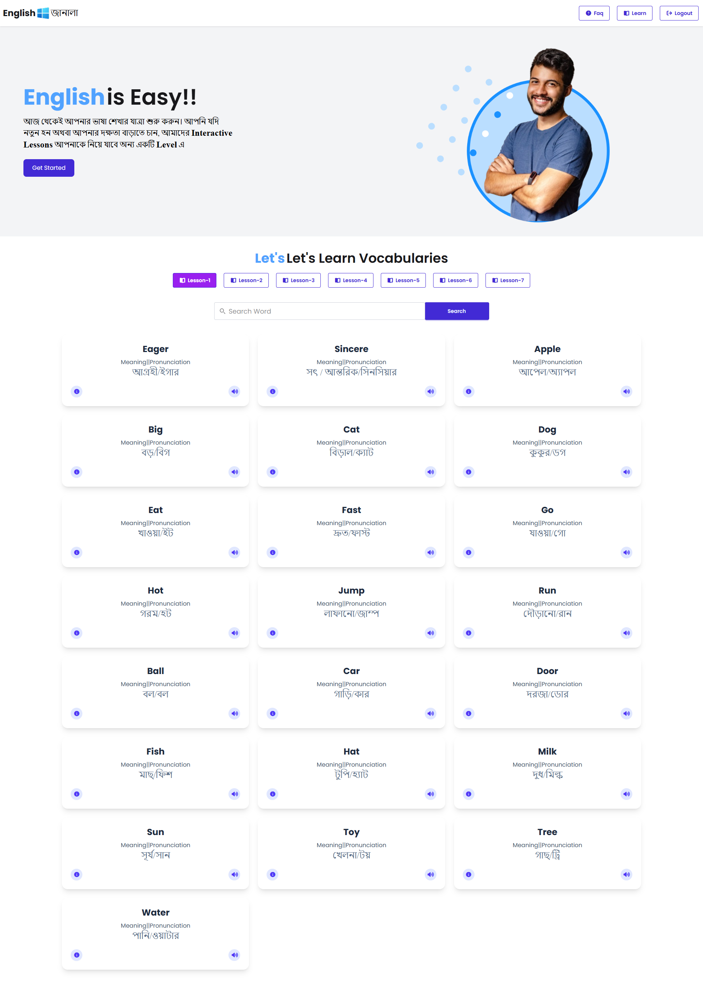

# 📘 English Janala

An interactive English Dictionary Web Application built using HTML, CSS, and JavaScript. This project allows users to learn vocabulary by selecting levels, viewing word meanings, pronunciation, examples, and listening to audio pronunciation using the Web Speech API.

---

## 🚀 Live Demo

[Explore English Janala Live](https://joygoswaminiloy2023-droid.github.io/english-janala/)

---

## 🎯 Project Overview

English Janala is a vocabulary learning web app that helps users improve their English skills. It fetches data from APIs and displays words based on selected lesson levels. Users can view meanings, pronunciation, examples, search words, save favorites, and listen to pronunciation.

This project focuses on API integration, DOM manipulation, search functionality, and interactive UI features.

---

## 📸 Screenshots

<table width="100%">
  <tr>
    <td width="50%" align="center">
      <h3>🏠 Home View</h3>
      
    </td>
    <td width="50%" align="center">
      <h3>📱 Full View</h3>
      
    </td>
  </tr>
</table>

---

## ✨ Features

- Display all lesson levels dynamically from API
- Load vocabulary words based on selected level
- Show word meaning, pronunciation, and example sentences
- Search functionality to find words quickly
- Save favorite words in a separate section
- Modal popup for detailed word information
- Text-to-speech pronunciation using Web Speech API
- Loading spinner during data fetching
- Active level button highlighting
- Proper handling of missing or invalid data

---

## 🌐 API Endpoints

- **Get All Levels:** `https://openapi.programming-hero.com/api/levels/all`  
- **Get Words by Level:** `https://openapi.programming-hero.com/api/level/{id}`  
  - *Example:* `https://openapi.programming-hero.com/api/level/5`  
- **Get Word Details:** `https://openapi.programming-hero.com/api/word/{id}`  
  - *Example:* `https://openapi.programming-hero.com/api/word/5`  
- **Get All Words:** `https://openapi.programming-hero.com/api/words/all`  

---

## 🔍 Search Functionality

Users can search any word using the search input. The app filters and displays matching results dynamically. When search is active, the selected level button is reset.

---

## ❤️ Save Word Feature

Users can click the heart icon to save words. Saved words are displayed in a separate section for easy revision and practice.

---

## 🔊 Pronunciation Feature

The app uses the Web Speech API to pronounce words when the sound icon is clicked.

```javascript
function pronounceWord(word) {
  const utterance = new SpeechSynthesisUtterance(word);
  utterance.lang = "en-EN";
  window.speechSynthesis.speak(utterance);
}
